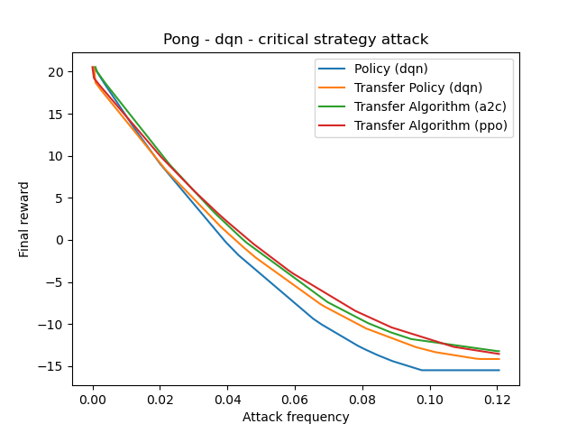

# Tianshou Reinforcement Learning Adversarial Attacks
This repository implements some classic adversarial attack methods for deep reinforcement learning agents including:
- Uniform attack [[link](https://arxiv.org/abs/1702.02284)].
- Strategical timed attack [[link](https://www.ijcai.org/Proceedings/2017/0525.pdf)].
- Critical point attack [[link](https://arxiv.org/abs/2005.07099)].
- Critical strategy attack.
- Adversarial policy attack [[link](https://arxiv.org/abs/1905.10615)].

Most of this project is based on the RL framework [tianshou](https://github.com/thu-ml/tianshou) based on Pytorch. Image adversarial attacks are implemented with [advertorch](https://github.com/BorealisAI/advertorch), also based on Pytorch. A2C and PPO policies are instead based on [pytorch-a2c-ppo-acktr-gail](https://github.com/ikostrikov/pytorch-a2c-ppo-acktr-gail).

## Available models
It also makes available trained models for different tasks which can be found in the folder `log`. The following table reports their average score for three different algorithms: DQN, A2C and PPO.

| task                        | DQN   | A2C   | PPO   |
|-----------------------------|-------|-------|-------|
| PongNoFrameskip-v4          | 20    | 20    | 21    |
| BreakoutNoFrameskip-v4      | 349   | 400   | 470   |
| EnduroNoFrameskip-v4        | 751   | NA    | 1064  |
| QbertNoFrameskip-v4         | 4382  | 7762  | 14580 | 
| MsPacmanNoFrameskip-v4      | 2787  | 2230  | 1929  |
| SpaceInvadersNoFrameskip-v4 | 640   | 856   | 1120  |
| SeaquestNoFrameskip-v4      | NA    | 1610  | 1798  |

## Usage
Before start using this repository, install the required libraries in the `requirements.txt` file.
```
  pip install -r requirements.txt"
```
**Train** DQN agent to play Pong.
```
  python atari_dqn.py --task "PongNoFrameskip-v4"
```
**Train** A2C agent to play Breakout.
```
  python atari_a2c_ppo.py --env-name "BreakoutNoFrameskip-v4" --algo a2c
```
**Train** PPO agent to play Breakout.
```
  python atari_a2c_ppo.py --env-name "BreakoutNoFrameskip-v4"--algo ppo --use-gae --lr 2.5e-4 --clip-param 0.1 --value-loss-coef 0.5 --num-processes 8 --num-steps 128 --num-mini-batch 4 --log-interval 1 --use-linear-lr-decay --entropy-coef 0.01
```
**Test** DQN agent playing Pong.
```
  python atari_dqn.py --resume_path "log/PongNoFrameskip-v4/dqn/policy.pth" --watch --test_num 10 --task "PongNoFrameskip-v4"
```
**Test** A2C agent playing Breakout.
```
  python atari_a2c_ppo.py --env-name "BreakoutNoFrameskip-v4" --algo a2c --resume_path "log/BreakoutNoFrameskip-v4/a2c/policy.pth" --watch --test_num 10
```
**Test** PPO agent playing Breakout.
```
  python atari_a2c_ppo.py --env-name "BreakoutNoFrameskip-v4" --algo ppo --resume_path "log/BreakoutNoFrameskip-v4/ppo/policy.pth" --watch --test_num 10
```
**Train** DQN malicious agent to play Pong minimizing the score.
```
  python atari_dqn.py --task "PongNoFrameskip-v4" --invert_reward --epoch 1
```
To understand how to perform adversarial attacks refer to the `example.ipynb` file and to the benchmark examples contained in the folder `benchmark`.

## Test transferability over policies
This section shows the performance of different adversarial attacks methods and their comparison between attacking an agent and 3 surrogate agents: one trained with the same policy and the others trained on a different algorithm.




