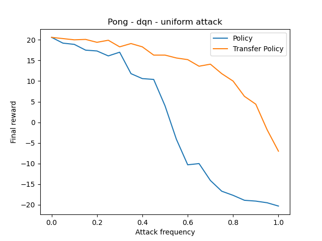
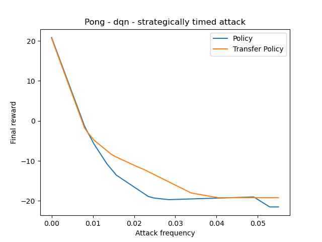
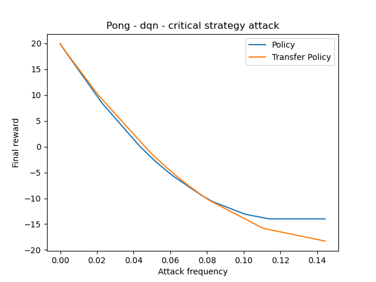
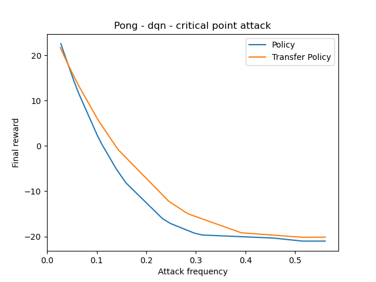
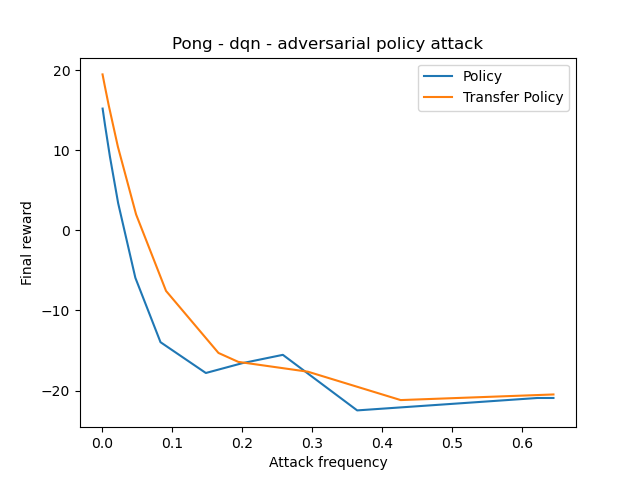

# Tianshou Reinforcement Learning Adversarial Attacks
This repository implements some classic adversarial attack methods for deep reinforcement learning agents including:
- Uniform attack [[link](https://arxiv.org/abs/1702.02284)].
- Strategical timed attack [[link](https://www.ijcai.org/Proceedings/2017/0525.pdf)].
- Critical point attack [[link](https://arxiv.org/abs/2005.07099)].
- Critical strategy attack.
- Adversarial policy attack [[link](https://arxiv.org/abs/1905.10615)].

## Available models
It also makes available trained models for different tasks which can be found in the folder `log`. The following table reports their average score, the commands used to train them and their corresponding algorithm.

| task                        | best reward | parameters                                                   | algorithm           |
| --------------------------- | ----------- | ------------------------------------------------------------ | ------------------- |
| PongNoFrameskip-v4          | 20          | `python3 atari_dqn.py --task "PongNoFrameskip-v4" --test_num 10` | DQN |
| BreakoutNoFrameskip-v4      | 349         | `python3 atari_dqn.py --task "BreakoutNoFrameskip-v4" --test_num 10`  | DQN    |
| EnduroNoFrameskip-v4        | 751         | `python3 atari_dqn.py --task "EnduroNoFrameskip-v4" --test_num 10`  | DQN    |
| QbertNoFrameskip-v4         | 4382        | `python3 atari_dqn.py --task "QbertNoFrameskip-v4" --test_num 10`  | DQN    |
| MsPacmanNoFrameskip-v4      | 2787        | `python3 atari_dqn.py --task "MsPacmanNoFrameskip-v4" --test_num 10`  | DQN    |
| SpaceInvadersNoFrameskip-v4 | 640         | `python3 atari_dqn.py --task "SpaceInvadersNoFrameskip-v4" --test_num 10`  | DQN    |

## Transferability over policies
This section shows the performance of different adversarial attacks methods and their comparison between attacking an agent and a surrogate agent trained with the same policy (transfer policy).

