# Reinforcement Learning Adversarial Attacks and Defenses
DQN policy             | Strategically-timed attack | Uniform attack | Adversarial training |
:-------------------------:|:-------------------------:|:------------|:---------------------|
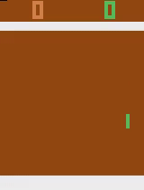 | 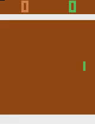 |  | 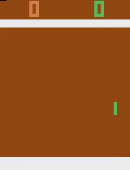 |

This repository implements some classic adversarial attack methods for deep reinforcement learning agents including (`drl_attacks/`):
- Uniform attack [[link](https://arxiv.org/abs/1702.02284)].
- Strategical timed attack [[link](https://www.ijcai.org/Proceedings/2017/0525.pdf)].
- Critical point attack [[link](https://arxiv.org/abs/2005.07099)].
- Critical strategy attack.
- Adversarial policy attack [[link](https://arxiv.org/abs/1905.10615)].

It is also available the following RL-defense method (`drl_defenses/`):
- Adversarial training [[link](https://arxiv.org/abs/1412.6572)].

Are provided also some image-defense methods (`img_defenses/`):
- JPEG conversion [[link](https://arxiv.org/pdf/1607.02533.pdf)].
- Bit squeezing [[link](https://arxiv.org/abs/1704.01155)].
- Image smoothing [[link](https://arxiv.org/abs/1704.01155)].

Most of this project is based on the RL framework [tianshou](https://github.com/thu-ml/tianshou) based on Pytorch. Image adversarial attacks and defenses are implemented with [advertorch](https://github.com/BorealisAI/advertorch), also based on Pytorch. A2C and PPO policies are instead based on [pytorch-a2c-ppo-acktr-gail](https://github.com/ikostrikov/pytorch-a2c-ppo-acktr-gail), DQN uses the tianshou implementation. Any image adversarial attacks is compatible with this project. 

## Available models
It also makes available trained models for different tasks which can be found in the folder `log`. The following table reports their average score for three different algorithms: DQN, A2C and PPO.

| task                        | DQN   | A2C   | PPO   |
|-----------------------------|-------|-------|-------|
| PongNoFrameskip-v4          | 20    | 20    | 21    |
| BreakoutNoFrameskip-v4      | 349   | 400   | 470   |
| EnduroNoFrameskip-v4        | 751   | NA    | 1064  |
| QbertNoFrameskip-v4         | 4382  | 7762  | 14580 | 
| MsPacmanNoFrameskip-v4      | 2787  | 2230  | 1929  |
| SpaceInvadersNoFrameskip-v4 | 640   | 856   | 1120  |
| SeaquestNoFrameskip-v4      | NA    | 1610  | 1798  |

Defended models are saved in the folder `log_def`. The average reward is reported as X/Y where X is the reward under
clear observations and Y is the reward under adversarial observations generated with uniform attack.

| task                        | DQN (AdvTr) | A2C (AdvTr) | PPO (AdvTr) |
|-----------------------------|-------|-------|-------|
| PongNoFrameskip-v4          | 19.6/19.4 | 18.8/17.9  | 19.7/18.7  |

## Image adversarial attacks effectiveness
The following table shows the **succeed ratio** of some common **image adversarial attacks** methods attacking observations taken from different Atari games environment. (U) and (T) mean that attacks have been performed under **untargeted** and **targeted** settings respectively. The victim agent is a PPO model.
- GSM: Gradient Sign Method (eps=0.01) [[link](https://arxiv.org/abs/1412.6572)]
- PGDA: Projected Gradient Descent Attack (eps=0.01, iter=100) [[link](https://arxiv.org/pdf/1706.06083.pdf)]
- CW: Carlini&Wagner (iter=100) [[link](https://arxiv.org/abs/1608.04644)]

| environment                 | GSM (U) | GSM (T) | PGDA (T) | CW (T) |
|-----------------------------|------|-------|-------|-------|
| PongNoFrameskip-v4          | 1    | 0.5   | 0.99 | 0.72 |
| BreakoutNoFrameskip-v4      | 0.98 | 0.4   | 0.83 | 0.47 |
| EnduroNoFrameskip-v4        | 1    | 0.34  | 0.37 | 0.3  |
| QbertNoFrameskip-v4         | 1    | 0.34  | 0.5  | 0.47 |
| MsPacmanNoFrameskip-v4      | 1    | 0.45  | 0.35 | 0.34 |
| SpaceInvadersNoFrameskip-v4 | 0.99 | 0.54  | 0.67 | 0.26 |
| SeaquestNoFrameskip-v4      | 1    | 0.8   | 0.5  | 0.4  |

## Usage
Before start using this repository, install the required libraries in the `requirements.txt` file.
```
  pip install -r requirements.txt"
```
**Train** DQN agent to play Pong.
```
  python atari_dqn.py --task "PongNoFrameskip-v4"
```
**Train** A2C agent to play Breakout.
```
  python atari_a2c_ppo.py --env-name "BreakoutNoFrameskip-v4" --algo a2c
```
**Test** DQN agent playing Pong.
```
  python atari_dqn.py --resume_path "log/PongNoFrameskip-v4/dqn/policy.pth" --watch --test_num 10 --task "PongNoFrameskip-v4"
```
**Test** A2C agent playing Breakout.
```
  python atari_a2c_ppo.py --env-name "BreakoutNoFrameskip-v4" --algo a2c --resume_path "log/BreakoutNoFrameskip-v4/a2c/policy.pth" --watch --test_num 10
```
**Train** DQN malicious agent to play Pong minimizing the score.
```
  python atari_dqn.py --task "PongNoFrameskip-v4" --invert_reward --epoch 1
```
**Defend** Pong DQN agent with **adversarial training**.
```
 python atari_adversarial_training_dqn.py --task "PongNoFrameskip-v4" --resume_path "log/PongNoFrameskip-v4/dqn/policy.pth" --logdir log_def --eps 0.01 --image_attack fgm
```
**Test** defended Pong DQN agent.
```
python atari_adversarial_training_dqn.py --task "PongNoFrameskip-v4" --resume_path "log_def/PongNoFrameskip-v4/dqn/policy.pth" --eps 0.01 --image_attack fgm --target_model_path log/PongNoFrameskip-v4/dqn/policy.pth --watch --test_num 10
```
To understand how to perform adversarial attacks refer to the `example.ipynb` file and to the benchmark examples contained in the folder `benchmark`.
Moreover, you can find more command examples in the following [page](https://github.com/davide97l/tianshou-rl-attacks/tree/master/benchmark).

## Test attack transferability over policies
This section shows the performance of different adversarial attacks methods and their comparison between attacking a DQN agent and 3 surrogate agents: one trained with the same policy and the others trained on a different algorithm.

Uniform             | Strategically-timed |
:-------------------------:|:-------------------------:|
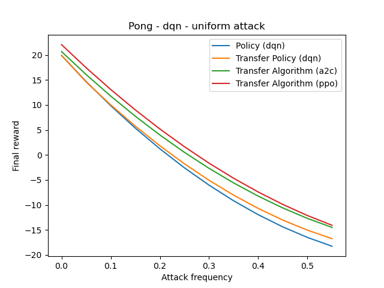 | 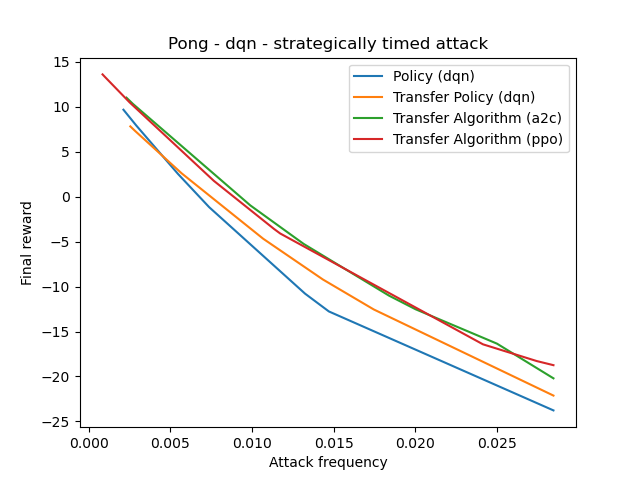 |
**Critical point**             | **Adversarial policy** |
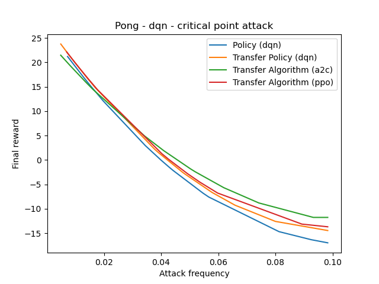 | 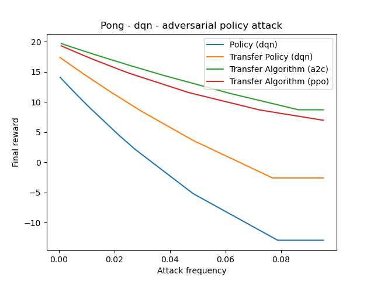 |

## Test attack transferability over defended policies
This section shows the performance of different adversarial attacks methods and their comparison between attacking a DQN agent defended with **adversarial training** and 3 surrogate agents: one trained with the same policy and the others trained on a different algorithm. The model has been adversarially trained with eps=0.1 but we attack it with eps=0.5 to show significant performance degradation.

Uniform             | Strategically-timed |
:-------------------------:|:-------------------------:|
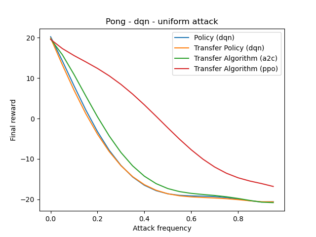 | 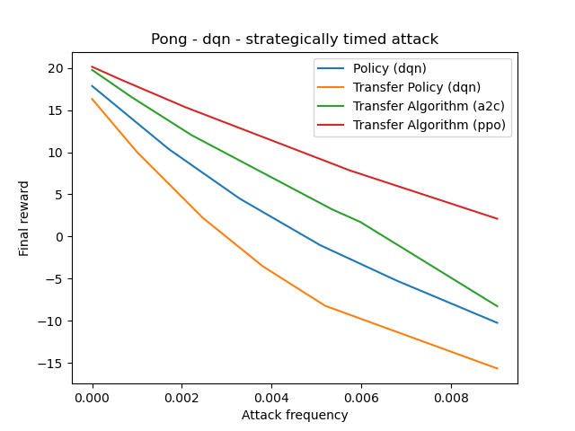 |

## Perturbation benchmark on defended policies
Test the performance of different image attacks methods attacking observations of DQN agent defended with different defense methods and attacking over different values of epsilon.
Image attacks:
- FGSM [[link](https://arxiv.org/abs/1412.6572)]
- PGD: Projected Gradient Descent [[link](https://arxiv.org/abs/1706.06083)]
- MI: Momentum Iterative [[link](https://arxiv.org/abs/1710.06081)]

FGSM adv training             | PGD adv training  |
:-------------------------:|:-------------------------:|
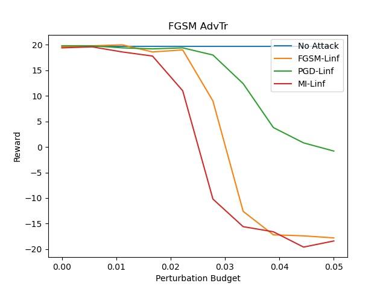 | 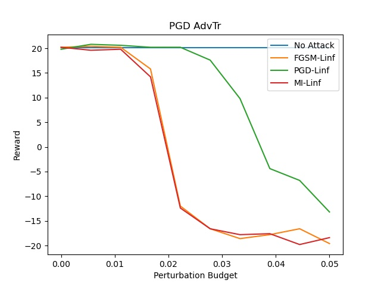 |
**JPEG conversion**             | **Bit squeezing** |
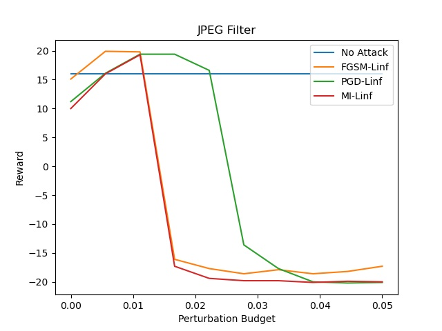 | 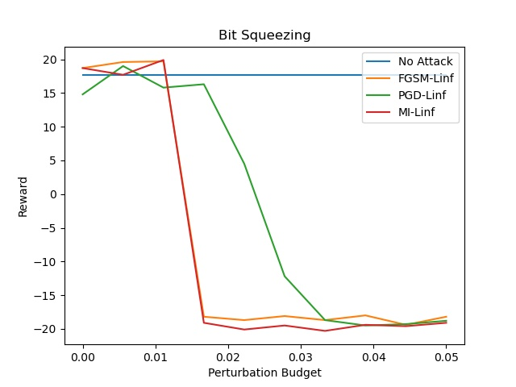 |

## Support
If you found this project interesting please support me by giving it a :star:, I would really appreciate it :grinning:
